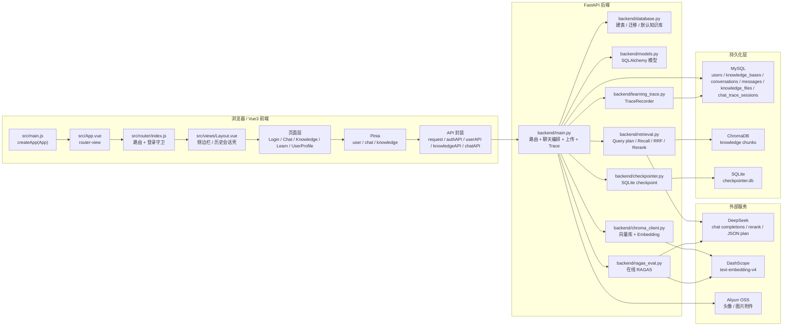
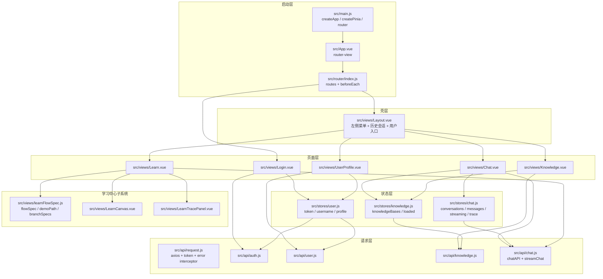
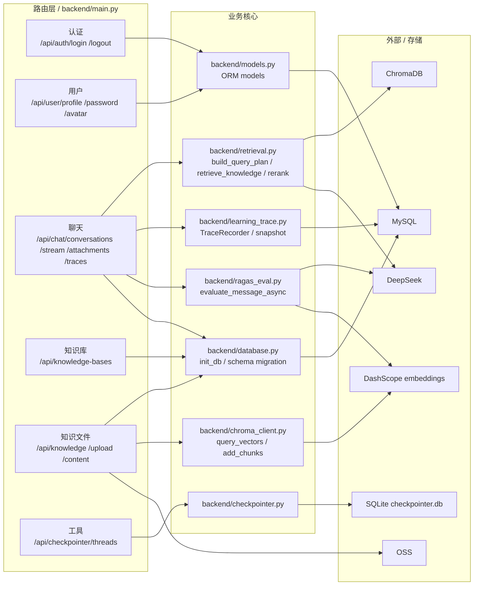
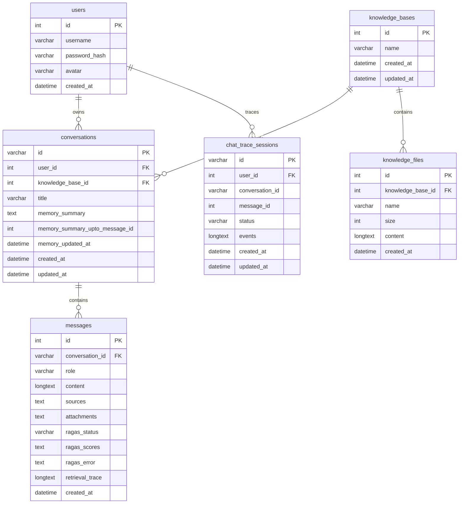
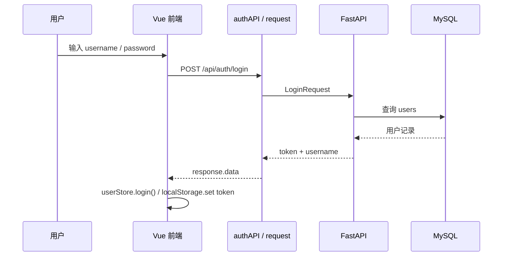
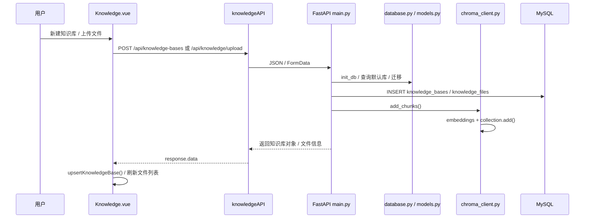
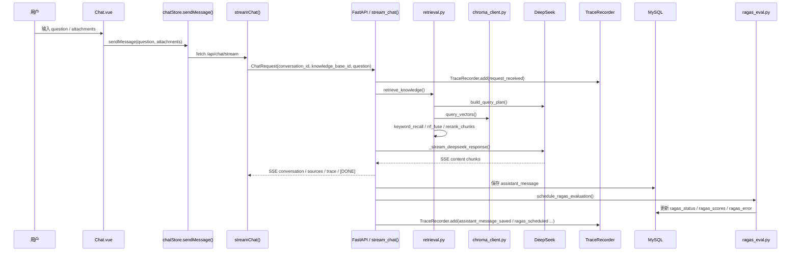
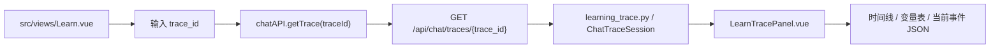

# 项目全量架构图 + 变量/方法索引

> 这份文档按仓库真实代码展开，目标是让读者从 0 理解整套企业知识库 RAG 系统。  
> 说明方式分成四层：模块关系图、核心流程图、数据库关系图、文件级符号索引。  
> 这里的“每条代码”按工程上可维护的方式落地为“全量关键符号索引 + 关键链路图”，避免一张图过大而不可读。

## 0. 读图顺序

1. 先看总览图，理解前端、后端、数据库、外部服务之间的边界。
2. 再看前端图和后端图，理解页面、Store、API、路由、业务函数如何串起来。
3. 接着看数据库 ER 图，理解数据怎么落表。
4. 最后看文件级符号索引，按文件把变量和方法对回源码。

## 1. 总览架构图

## 2. 前端架构图

## 3. 后端架构图

## 4. 数据库 ER 图

> `chat_trace_sessions.conversation_id` 和 `message_id` 是逻辑引用字段，代码中用于 Trace 回放关联，不是显式外键约束。

## 5. 核心流程图

### 5.1 登录与鉴权

### 5.2 知识库创建与文件上传

### 5.3 聊天 SSE、检索、RAGAS 与 Trace

### 5.4 Trace 回放

## 6. 运行配置与外部依赖

| 类别 | 关键配置 | 作用 |
|---|---|---|
| 前端 | `VITE_API_BASE_URL` | 前端请求后端 API 的基础路径 |
| MySQL | `MYSQL_USER / MYSQL_PASSWORD / MYSQL_HOST / MYSQL_PORT / MYSQL_DATABASE` | 业务主库 |
| Chroma | `CHROMA_PERSIST_DIR` | 向量库持久化目录 |
| DeepSeek | `DEEPSEEK_API_KEY / DEEPSEEK_BASE_URL / DEEPSEEK_MODEL` | 规划、重排、回答生成 |
| Embedding | `EMBEDDING_BASE_URL / EMBEDDING_API_KEY / EMBEDDING_MODEL / EMBEDDING_DIM` | DashScope 向量化 |
| RAGAS | `RAGAS_ENABLED / RAGAS_LLM_MODEL / RAGAS_TIMEOUT_SECONDS` 等 | 在线评估 |
| OSS | `OSS_ACCESS_KEY_ID / OSS_ACCESS_KEY_SECRET / OSS_BUCKET / OSS_ENDPOINT` | 图片附件和头像 |
| Trace | `LEARNING_TRACE_ENABLED / LEARNING_TRACE_MAX_TEXT_CHARS` | 学习中心与回放 |

## 7. 文件级符号索引 - 前端

### `src/main.js`

| 符号 | 类型 | 作用 |
|---|---|---|
| `app` | 变量 | Vue 应用实例 |
| `createPinia()` | 调用 | 注册全局状态管理 |
| `router` | 插件 | 注册路由 |

### `src/router/index.js`

| 符号 | 类型 | 作用 |
|---|---|---|
| `routes` | 路由数组 | 定义 `/login`、`/chat`、`/knowledge`、`/learn`、`/profile` |
| `router` | 路由实例 | `createRouter` + `createWebHistory` |
| `beforeEach` | 守卫 | 未登录跳 `/login`，已登录回 `/chat` |

### `src/api/request.js`

| 符号 | 类型 | 作用 |
|---|---|---|
| `request` | axios 实例 | 统一 `baseURL`、token、错误提示 |
| 请求拦截器 | interceptor | 自动带 `Authorization` |
| 响应拦截器 | interceptor | 统一处理 401 和后端报错文本 |

### `src/api/*.js`

| 文件 | 符号 | 作用 |
|---|---|---|
| `auth.js` | `authAPI.login()` / `authAPI.logout()` | 登录和退出 |
| `user.js` | `userAPI.getProfile()` / `updatePassword()` / `uploadAvatar()` | 用户资料和头像 |
| `knowledge.js` | `knowledgeAPI.getList()` / `getBases()` / `createBase()` / `renameBase()` / `deleteBase()` / `getDetail()` / `getContent()` / `upload()` / `delete()` / `batchDelete()` | 知识库和知识文件 CRUD |
| `chat.js` | `chatAPI.getConversations()` / `getMessages()` / `getTrace()` / `getMessageTrace()` / `uploadAttachment()` / `streamChat()` | 聊天、Trace 和附件上传 |

### `src/stores/user.js`

| 符号 | 类型 | 作用 |
|---|---|---|
| `token` | `ref` | JWT token |
| `username` | `ref` | 当前用户名 |
| `profile` | `ref` | 用户资料 |
| `isLoggedIn` | `computed` | 是否已登录 |
| `displayName` | `computed` | 展示名 |
| `avatarText` | `computed` | 头像首字母 |
| `avatarUrl` | `computed` | 头像地址 |
| `login()` | 方法 | 登录并写入本地存储 |
| `fetchProfile()` | 方法 | 拉取用户资料 |
| `uploadAvatar()` | 方法 | 上传头像 |
| `logout()` | 方法 | 清 token 并退出 |

### `src/stores/knowledge.js`

| 符号 | 类型 | 作用 |
|---|---|---|
| `knowledgeBases` | `ref` | 知识库列表 |
| `loading` | `ref` | 拉取状态 |
| `loaded` | `ref` | 是否已加载过 |
| `hasKnowledgeBases` | `computed` | 是否存在知识库 |
| `normalizeKnowledgeBase()` | 方法 | 统一知识库对象结构 |
| `setKnowledgeBases()` | 方法 | 覆盖列表 |
| `fetchKnowledgeBases()` | 方法 | 拉取知识库列表 |
| `refreshKnowledgeBases()` | 方法 | 强制刷新 |
| `upsertKnowledgeBase()` | 方法 | 创建/更新后本地插入或替换 |

### `src/stores/chat.js`

| 符号 | 类型 | 作用 |
|---|---|---|
| `conversations` | `ref` | 会话列表 |
| `currentId` | `ref` | 当前会话 ID |
| `messages` | `ref` | 当前消息列表 |
| `loading` | `ref` | 读消息状态 |
| `historyManageMode` | `ref` | 历史会话管理模式 |
| `selectedConversationIds` | `ref` | 批量选择集合 |
| `streaming` | `ref` | 是否正在流式生成 |
| `streamContent` | `ref` | SSE 拼接中的回答文本 |
| `streamSources` | `ref` | 流式返回的来源列表 |
| `streamTrace` | `ref` | 流式 Trace 片段 |
| `streamingConversationId` | `ref` | 当前流对应的会话 |
| `pendingRouteConversationId` | `ref` | 流中待路由会话 |
| `selectedKnowledgeBaseId` | `ref` | 当前知识库选择 |
| `errorMessage` | `ref` | 错误提示 |
| `streamImageAnalysis` | `ref` | 图片分析结果 |
| `currentConversation` | `computed` | 当前会话对象 |
| `fetchConversations()` | 方法 | 列出会话 |
| `upsertConversation()` | 方法 | 更新会话元数据 |
| `selectConversation()` | 方法 | 切换会话并拉消息 |
| `addMessage()` | 方法 | 本地追加消息 |
| `replaceMessages()` | 方法 | 替换消息列表 |
| `setCurrentId()` / `setSelectedKnowledgeBaseId()` | 方法 | 设置当前会话 / 知识库 |
| `sendMessage()` | 方法 | 组装参数并调用 `streamChat()` |
| `handleStreamDone()` | 方法 | 流结束后落本地消息、拉会话、触发评估 |
| `handleStreamError()` | 方法 | 处理中断/失败 |
| `stopGeneration()` | 方法 | Abort 当前流 |
| `finishStreaming()` | 方法 | 清理流式状态 |
| `getStreamErrorMessage()` | 方法 | 统一错误文案 |
| `normalizeImageAnalysis()` | 方法 | 图片分析结构化 |
| `streamImageAnalysisFields()` | 方法 | 将图片分析写进消息字段 |
| `mergeStreamTrace()` | 方法 | 合并 trace SSE 片段 |
| `cloneTrace()` | 方法 | 拷贝 trace |
| `deleteConversation()` | 方法 | 删除会话 |
| `refreshMessages()` | 方法 | 刷新消息并保留本地 assistant 草稿 |
| `hasPendingEvaluation()` | 方法 | 检查评估是否未完成 |
| `startEvaluationPolling()` / `stopEvaluationPolling()` | 方法 | 轮询 RAGAS 状态 |
| `markLocalEvaluationTimeout()` | 方法 | 本地 pending 超时处理 |
| `renameConversation()` | 方法 | 重命名会话 |
| `clearMessages()` | 方法 | 清空当前对话 |
| `normalizeMessage()` | 方法 | 消息归一化 |

### `src/views/Layout.vue`

| 符号 | 类型 | 作用 |
|---|---|---|
| `route` / `router` | 路由对象 | 判断当前菜单与导航 |
| `chatStore` / `userStore` | store | 侧边栏历史会话与用户信息 |
| `activeMenu` | computed | 当前菜单高亮 |
| `avatarSrc` | computed | 头像地址 |
| `allConversationsSelected` | computed | 批量选择状态 |
| `newConversation()` | 方法 | 回到新对话 |
| `selectConversation()` | 方法 | 切换到某会话 |
| `handleConversationClick()` | 方法 | 处理点击与批量管理切换 |
| `removeConversation()` | 方法 | 删除会话 |
| `toggleHistoryManageMode()` | 方法 | 切换管理模式 |
| `removeSelectedConversations()` | 方法 | 批量删除会话 |
| `normalizeAvatarUrl()` | 方法 | 头像路径归一化 |
| `handleUserCommand()` | 方法 | 跳个人设置 / 退出 |

### `src/views/Chat.vue`

| 符号 | 类型 | 作用 |
|---|---|---|
| `route` / `router` / `chatStore` / `knowledgeStore` | 对象 | 页面编排依赖 |
| `chatRef` | `ref` | 消息容器滚动区 |
| `question` | `ref` | 输入框文本 |
| `renaming` / `renameTitle` / `renameRef` | `ref` | 会话重命名状态 |
| `sourcesVisible` / `activeSources` | `ref` | 参考资料弹层 |
| `traceVisible` / `traceLoading` / `traceTab` / `activeTrace` | `ref` | Trace 弹层 |
| `attachments` / `uploadingAttachment` | `ref` | 图片附件输入 |
| `knowledgeBases` / `selectedKnowledgeBaseId` | computed/ref | 当前知识库选择 |
| `isCurrentConversationStreaming` | computed | 是否正在生成 |
| `currentKnowledgeBaseName` | computed | 当前知识库名称 |
| `suggestions` / `ragasMetrics` | 常量 | 页面快捷问句 / RAGAS 指标 |
| `traceEvents` / `traceVariableRows` / `retrievalRoutes` / `memoryEvents` / `ragasEvents` / `prettyTrace` | computed | Trace 相关可视化数据 |
| `askSuggestion()` | 方法 | 点击快捷问句 |
| `createNewConversation()` | 方法 | 新建对话 |
| `sendMessage()` | 方法 | 读取输入框和附件并调用 store |
| `handleInputEnter()` | 方法 | Enter 发送、Shift+Enter 换行 |
| `stopGeneration()` | 方法 | 中止生成 |
| `copyMessage()` | 方法 | 复制回答 |
| `regenerate()` | 方法 | 重新生成 |
| `startRename()` / `confirmRename()` | 方法 | 重命名会话 |
| `scrollToBottom()` | 方法 | 滚动到底部 |
| `openSources()` | 方法 | 打开来源 drawer |
| `hasTrace()` / `openTrace()` | 方法 | 打开 Trace 弹层 |
| `normalizeTrace()` | 方法 | 规范化 trace |
| `formatJson()` / `stringifyBrief()` / `formatScore()` | 方法 | Trace / 分数展示 |
| `ragasStatusText()` / `ragasStatusClass()` | 方法 | RAGAS 状态展示 |
| `shouldShowImageAnalysisWarning()` / `imageAnalysisWarningText()` | 方法 | 图片分析提示 |
| `refreshKnowledgeBases()` / `syncSelectedKnowledgeBase()` / `changeKnowledgeBase()` | 方法 | 知识库同步 |
| `handleImageUpload()` / `removeAttachment()` | 方法 | 图片上传 / 删除 |

### `src/views/Knowledge.vue`

| 符号 | 类型 | 作用 |
|---|---|---|
| `allFiles` | `ref` | 当前知识库文件列表 |
| `currentKnowledgeBaseId` | `ref` | 选择中的知识库 |
| `loading` / `uploading` / `uploadPercent` | `ref` | 页面加载与上传状态 |
| `keyword` / `sortField` / `sortOrder` / `page` / `pageSize` | `ref` | 搜索和分页 |
| `selectedFiles` | `ref` | 批量选择文件 |
| `detailVisible` / `detailFile` / `detailContent` / `contentLoading` | `ref` | 文件详情抽屉/弹层 |
| `knowledgeBaseDialogVisible` / `knowledgeBaseSubmitting` / `knowledgeBaseDialogMode` | `ref` | 新建/重命名知识库弹层 |
| `knowledgeBaseFormRef` / `knowledgeBaseInputRef` / `knowledgeBaseForm` | `ref/reactive` | 表单状态 |
| `knowledgeStore` / `knowledgeBases` | store/computed | 知识库列表 |
| `acceptTypes` / `knowledgeBaseRules` | 常量 | 上传类型和表单校验 |
| `filteredFiles` / `pagedFiles` | computed | 搜索过滤和分页结果 |
| `knowledgeBaseDialogTitle` / `knowledgeBaseDialogDescription` / `knowledgeBaseDialogSubmitText` | computed | 弹层文案 |
| `fetchFiles()` / `initializeKnowledgeBases()` / `fetchKnowledgeBases()` | 方法 | 拉文件与知识库 |
| `handleKnowledgeBaseChange()` | 方法 | 切换知识库后刷新文件 |
| `openKnowledgeBaseDialog()` / `submitKnowledgeBaseDialog()` / `resetKnowledgeBaseDialog()` | 方法 | 知识库弹层操作 |
| `isDuplicateKnowledgeBaseError()` / `resolveKnowledgeBaseId()` / `refreshKnowledgeBasesPreserving()` | 方法 | 处理同名校验与状态保留 |
| `deleteKnowledgeBase()` | 方法 | 删除知识库 |
| `handleSearch()` / `applyFilters()` / `handleSortChange()` / `handleSelectionChange()` | 方法 | 列表交互 |
| `handleUploadInputChange()` / `handleUpload()` / `openUploadDialog()` | 方法 | 文件上传 |
| `confirmDelete()` / `confirmBatchDelete()` / `confirmCentered()` | 方法 | 删除确认弹窗 |
| `refreshKnowledgeBaseAndFiles()` | 方法 | 同步刷新 |
| `showDetail()` / `copyContent()` | 方法 | 查看文件详情与复制内容 |
| `getFileIcon()` / `getFileExt()` / `formatSize()` / `formatTime()` | 方法 | 文件显示辅助 |

### `src/views/UserProfile.vue`

| 符号 | 类型 | 作用 |
|---|---|---|
| `userStore` | store | 用户资料源 |
| `formRef` / `submitting` | `ref` | 密码修改表单状态 |
| `avatarSrc` | computed | 头像地址 |
| `form` | `reactive` | 修改密码表单 |
| `rules` | 常量 | 表单校验 |
| `handleSubmit()` | 方法 | 修改密码 |
| `handleAvatarUpload()` | 方法 | 头像上传 |
| `normalizeAvatarUrl()` / `formatTime()` | 方法 | 头像和时间展示 |

### `src/views/Login.vue`

| 符号 | 类型 | 作用 |
|---|---|---|
| `route` / `router` / `userStore` | 对象 | 登录后跳转与状态写入 |
| `formRef` / `loading` | `ref` | 登录表单状态 |
| `form` | `reactive` | username/password |
| `rules` | 常量 | 表单校验 |
| `handleLogin()` | 方法 | 调用 `userStore.login()` |

### `src/views/Learn.vue`

| 符号 | 类型 | 作用 |
|---|---|---|
| `route` | 路由对象 | 支持 `trace_id` query 回放 |
| `mode` | `ref` | `demo` / `trace` 模式 |
| `demoIndex` / `demoPlaying` / `demoTimer` | `ref` | 示例演示播放状态 |
| `selectedNodeId` | `ref` | 当前选中的画布节点 |
| `traceIdInput` / `traceLoading` / `traceError` | `ref` | Trace 加载输入与错误 |
| `normalizedTrace` | `ref` | 归一化后的真实 trace |
| `selectedTraceIndex` | `ref` | 当前选中的 trace event |
| `nodeMap` / `currentDemoNode` / `selectedNode` | computed | 画布节点查找与详情 |
| `activeNodeIds` | computed | 演示或回放时高亮路径 |
| `upstreamRelations` / `downstreamRelations` | computed | 选中节点上下游 |
| `startDemoTimer()` / `stopDemoTimer()` / `toggleDemoPlay()` / `resetDemo()` | 方法 | 演示播放控制 |
| `handleNodeSelect()` | 方法 | 画布点选同步 |
| `normalizeTrace()` | 方法 | Trace 归一化 |
| `clearTrace()` / `loadTrace()` | 方法 | 真实回放加载与清空 |
| `handleTraceEventSelect()` | 方法 | 时间线点选同步 |
| `isBranchRelevant()` | 方法 | 分支槽高亮判断 |

### `src/views/learnFlowSpec.js`

| 符号 | 类型 | 作用 |
|---|---|---|
| `exampleQuestion` | 常量 | 默认示例问题 |
| `flowSpec` | 常量 | 画布节点、位置、连线的总配置 |
| `demoPath` | 常量 | 示例演示主路径 |
| `branchSpecs` | 常量 | 失败分支槽 |
| `symbolToNodeId` | 常量 | 真实符号到画布节点的映射 |
| `getNodeById()` | 方法 | 根据节点 ID 查找节点 |
| `getNodeIdBySymbol()` | 方法 | 根据真实符号名找节点 |

### `src/views/LearnCanvas.vue`

| 符号 | 类型 | 作用 |
|---|---|---|
| `props` | 组件入参 | `nodes / edges / selectedNodeId / activeNodeIds / width / height` |
| `activeSet` | computed | 高亮节点集合 |
| `nodeSize()` | 方法 | 变量气泡 / 方法矩形尺寸 |
| `renderedNodes` | computed | 把 spec 变成可渲染节点 |
| `resolveNode()` | 方法 | 通过节点 ID 找节点 |
| `makePath()` | 方法 | 计算贝塞尔连线 |
| `renderedEdges` | computed | 画布连线和标签 |
| `canvasStyle` | computed | 画布尺寸 |

### `src/views/LearnTracePanel.vue`

| 符号 | 类型 | 作用 |
|---|---|---|
| `props` | 组件入参 | `trace / selectedIndex` |
| `activeTab` | `ref` | 时间线 / 变量表 / 当前事件 |
| `events` | computed | trace 事件数组 |
| `selectedEvent` | computed | 当前选中的事件 |
| `variableRows` | computed | `params / uses / creates / result` 展平表 |
| `selectedEventJson` | computed | 当前事件 JSON |
| `stringifyJson()` | 方法 | 安全 JSON 序列化 |
| `stringifyBrief()` | 方法 | 截断展示值 |

### `src/components/MarkdownRenderer.vue`

| 符号 | 类型 | 作用 |
|---|---|---|
| `props.content` | 组件入参 | 待渲染 Markdown |
| `rendered` | computed | `marked` 渲染后的 HTML |
| `sanitizeHtml()` | 方法 | 简单 HTML 清洗，过滤危险标签/链接 |

### `src/utils/index.js`

| 符号 | 类型 | 作用 |
|---|---|---|
| `formatDate()` | 方法 | 相对时间格式化 |
| `storage` | 对象 | `get / set / remove` 的 localStorage 封装 |

## 8. 文件级符号索引 - 后端

### `backend/config.py`

| 符号 | 类型 | 作用 |
|---|---|---|
| `DATABASE_URL` | 常量 | MySQL 连接串 |
| `CHROMA_PERSIST_DIR` | 常量 | Chroma 持久化目录 |
| `REBUILD_KNOWLEDGE_INDEX_ON_STARTUP` | 常量 | 是否启动时重建索引 |
| `CHECKPOINTER_DB_PATH` | 常量 | SQLite checkpoint 路径 |
| `DEEPSEEK_API_KEY` / `DEEPSEEK_BASE_URL` / `DEEPSEEK_MODEL` | 常量 | DeepSeek 配置 |
| `VISION_BASE_URL` / `VISION_API_KEY` / `VISION_MODEL` / `VISION_OSS_URL_EXPIRES_SECONDS` | 常量 | 图片分析配置 |
| `TEXT_FALLBACK_*` | 常量 | DeepSeek 不可用时的文本兜底 |
| `EMBEDDING_*` | 常量 | DashScope 向量化配置 |
| `RAGAS_*` | 常量 | 在线评估参数 |
| `RETRIEVAL_ROUTE_TOP_K` / `RETRIEVAL_RERANK_TOP_N` | 常量 | 检索参数 |
| `MEMORY_*` | 常量 | 会话记忆摘要参数 |
| `LEARNING_TRACE_ENABLED` / `LEARNING_TRACE_MAX_TEXT_CHARS` | 常量 | Trace 调试 |
| `OSS_*` | 常量 | 阿里云 OSS |
| `SECRET_KEY` / `ALGORITHM` / `ACCESS_TOKEN_EXPIRE_MINUTES` | 常量 | JWT |

### `backend/models.py`

| 符号 | 类型 | 作用 |
|---|---|---|
| `_new_id()` | 方法 | 生成短 ID |
| `User` | ORM 模型 | 用户表 |
| `KnowledgeBase` | ORM 模型 | 知识库表 |
| `Conversation` | ORM 模型 | 会话表 |
| `Message` | ORM 模型 | 消息表 |
| `KnowledgeFile` | ORM 模型 | 知识文件表 |
| `ChatTraceSession` | ORM 模型 | 学习 Trace 会话表 |

### `backend/database.py`

| 符号 | 类型 | 作用 |
|---|---|---|
| `engine` | SQLAlchemy 引擎 | MySQL 连接 |
| `SessionLocal` | sessionmaker | DB 会话工厂 |
| `Base` | DeclarativeBase | ORM 基类 |
| `get_db()` | 依赖注入 | FastAPI DB 会话 |
| `init_db()` | 方法 | 建表 + 迁移 + 默认库 |
| `_ensure_schema_columns()` | 方法 | 补字段和字符集修复 |
| `_ensure_mysql_utf8mb4()` | 方法 | 数据库/表转 utf8mb4 |
| `_ensure_mysql_text_column()` / `_ensure_mysql_varchar_column()` / `_ensure_mysql_character_column()` | 方法 | 字符集修复 |
| `_get_mysql_column_info()` | 方法 | 读取 information_schema |
| `_ensure_default_knowledge_base()` | 方法 | 初始化默认知识库 |

### `backend/chroma_client.py`

| 符号 | 类型 | 作用 |
|---|---|---|
| `LEGACY_COLLECTION_NAME` | 常量 | 旧集合名 |
| `COLLECTION_NAME` | 常量 | 当前集合名 |
| `_HashEmbeddingFunction` | 类 | 本地哈希兜底 embedding |
| `_OpenAICompatibleEmbeddingFunction` | 类 | OpenAI 兼容 embedding |
| `_hash_embedding_fn` / `_embedding_fn` | 对象 | embedding 函数实例 |
| `embedding_backend_status()` | 方法 | 返回 embedding 配置状态 |
| `get_chroma_client()` | 方法 | 获取持久化客户端 |
| `get_collection()` | 方法 | 获取集合 |
| `add_chunks()` | 方法 | 写入 chunk 到 Chroma |
| `delete_file_chunks()` | 方法 | 删除文件对应 chunk |
| `query_vectors()` | 方法 | 向量召回 |
| `search_knowledge()` | 方法 | 旧接口风格召回 |

### `backend/retrieval.py`

| 符号 | 类型 | 作用 |
|---|---|---|
| `normalize_deepseek_model()` | 方法 | 别名归一化 |
| `deepseek_chat_url()` | 方法 | 拼接 DeepSeek 接口地址 |
| `call_deepseek_json()` | 方法 | 调 DeepSeek 返回 JSON |
| `build_query_plan()` | 方法 | HyDE / rewrites / keywords 规划 |
| `retrieve_knowledge()` | 方法 | 总检索入口 |
| `keyword_recall()` | 方法 | 关键词回召 |
| `rrf_fuse()` | 方法 | 多路结果融合 |
| `rerank_chunks()` | 方法 | DeepSeek 重排 |
| `_parse_json_object()` | 方法 | 从模型文本中解析 JSON |
| `_clean_list()` | 方法 | 清洗字符串数组 |
| `_fallback_keywords()` | 方法 | 规划失败时兜底关键词 |
| `_merge_keywords()` | 方法 | 合并模型关键词与兜底关键词 |
| `_dedupe_keywords()` | 方法 | 去重 |
| `_expand_keywords()` | 方法 | 扩展关键词 |
| `_keyword_score()` | 方法 | chunk 关键词打分 |
| `_has_close_matches()` | 方法 | 判断关键短语是否近邻出现 |
| `_normalize_for_match()` | 方法 | 匹配归一化 |
| `_select_final_chunks()` | 方法 | 最终 chunk 选择 |
| `_split_keyword_chunks()` | 方法 | 按窗口切块 |
| `_chunk_key()` | 方法 | chunk 去重 key |
| `_trace_chunk()` | 方法 | 检索 trace 摘要 |

### `backend/learning_trace.py`

| 符号 | 类型 | 作用 |
|---|---|---|
| `_now_iso()` | 方法 | trace 时间戳 |
| `_clip_text()` | 方法 | 文本截断 |
| `sanitize_trace_value()` | 方法 | 敏感值清洗 |
| `compact_trace_reference()` | 方法 | trace 引用摘要 |
| `summarize_text()` | 方法 | 文本摘要 |
| `summarize_messages()` | 方法 | 消息摘要 |
| `TraceRecorder` | 类 | 学习 Trace 记录器 |
| `TraceRecorder.add()` | 方法 | 记录步骤、变量、结果 |
| `TraceRecorder.finish()` | 方法 | 结束 trace |
| `TraceRecorder.attach()` | 方法 | 绑定 conversation/message |
| `TraceRecorder.snapshot()` | 方法 | 导出完整 trace |
| `TraceRecorder.drain_sse_payloads()` | 方法 | 输出 SSE trace payload |
| `append_trace_event()` | 方法 | 追加 trace 事件到 DB |
| `get_trace_snapshot()` | 方法 | 读取 trace |
| `serialize_trace_session()` | 方法 | 序列化 trace session |

### `backend/ragas_eval.py`

| 符号 | 类型 | 作用 |
|---|---|---|
| `evaluate_message_async()` | 方法 | 异步 RAGAS 入口 |
| `schedule_ragas_evaluation()` | 方法 | 调度后台评估任务 |
| `_evaluate_message_sync()` | 方法 | 同步评分执行 |
| `_make_ragas_llm()` | 方法 | 构造 RAGAS LLM |
| `_ResponseRelevancyEmbeddingsAdapter` | 类 | RAGAS embedding 适配器 |
| `_score_metric()` | 方法 | 单指标打分 |
| `_score_metric_with_timeout()` | 方法 | 指标超时控制 |
| `_mark_message()` | 方法 | 写回 message 的评估状态 |
| `_format_metric_errors()` | 方法 | 格式化部分失败信息 |
| `_friendly_error()` | 方法 | 异常转中文错误 |
| `_openai_base_url()` | 方法 | OpenAI 兼容 base_url |
| `_prepare_contexts()` | 方法 | 上下文裁剪 |
| `_truncate_text()` | 方法 | 文本裁剪 |

### `backend/checkpointer.py`

| 符号 | 类型 | 作用 |
|---|---|---|
| `_get_conn()` | 方法 | 打开 / 初始化 SQLite |
| `save_checkpoint()` | 方法 | 保存 checkpoint |
| `load_checkpoint()` | 方法 | 读取 checkpoint |
| `delete_thread_checkpoints()` | 方法 | 删除线程相关 checkpoint |
| `list_threads()` | 方法 | 列出 checkpoint 线程 |

### `backend/main.py`

#### 启动与基础依赖

| 符号 | 类型 | 作用 |
|---|---|---|
| `lifespan()` | 异步生命周期 | 启动时建库 / 索引初始化 |
| `root()` | 路由 | `/` |
| `health()` | 路由 | `/health` |
| `_seed_default_users()` | 方法 | 初始化默认用户 |
| `_get_default_knowledge_base()` | 方法 | 兜底知识库 |
| `_resolve_knowledge_base()` | 方法 | 选择知识库 |
| `_rebuild_existing_knowledge_index()` | 方法 | 重建 Chroma 索引 |

#### 认证与用户

| 符号 | 类型 | 作用 |
|---|---|---|
| `create_token()` | 方法 | 生成 JWT |
| `_decode_token()` | 方法 | 解码 JWT |
| `get_current_user()` | 方法 | 鉴权依赖 |
| `LoginRequest` | Pydantic 模型 | 登录请求 |
| `LoginResponse` | Pydantic 模型 | 登录响应 |
| `PasswordUpdate` | Pydantic 模型 | 修改密码请求 |
| `login()` | 路由 | `/api/auth/login` |
| `logout()` | 路由 | `/api/auth/logout` |
| `get_profile()` | 路由 | `/api/user/profile` |
| `update_password()` | 路由 | `/api/user/password` |
| `upload_avatar()` | 路由 | `/api/user/avatar` |

#### 会话、Trace 与聊天

| 符号 | 类型 | 作用 |
|---|---|---|
| `ChatRequest` | Pydantic 模型 | `conversation_id / knowledge_base_id / question / attachments` |
| `list_conversations()` | 路由 | `/api/chat/conversations` |
| `get_messages()` | 路由 | `/api/chat/conversations/{cid}` |
| `get_chat_trace()` | 路由 | `/api/chat/traces/{trace_id}` |
| `get_message_trace()` | 路由 | `/api/chat/messages/{message_id}/trace` |
| `delete_conversation()` | 路由 | 删除会话 |
| `RenameRequest` | Pydantic 模型 | 重命名会话请求 |
| `rename_conversation()` | 路由 | 重命名会话 |
| `_serialize_message()` | 方法 | 消息序列化 |
| `_trace_sse_payloads()` | 方法 | Trace SSE payload |
| `_safe_trace_add()` / `_safe_trace_finish()` / `_safe_trace_attach()` | 方法 | 保护 Trace 的安全封装 |
| `stream_chat()` | 路由 | `/api/chat/stream` SSE 主链路 |
| `_build_memory_context()` | 方法 | 会话记忆上下文 |
| `_build_memory_aware_retrieval_question()` | 方法 | 记忆增强检索问题 |
| `_format_recent_memory_messages()` | 方法 | 最近消息格式化 |
| `_schedule_memory_summary_update()` / `_maybe_update_memory_summary()` | 方法 | 记忆摘要异步更新 |
| `_format_messages_for_summary()` / `_summarize_conversation_memory()` | 方法 | 记忆摘要生成 |

#### 知识库与知识文件

| 符号 | 类型 | 作用 |
|---|---|---|
| `KnowledgeBaseRequest` | Pydantic 模型 | 知识库创建/重命名 |
| `_serialize_knowledge_base()` | 方法 | 知识库对象序列化 |
| `list_knowledge_bases()` | 路由 | `/api/knowledge-bases` |
| `create_knowledge_base()` | 路由 | 创建知识库 |
| `rename_knowledge_base()` | 路由 | 重命名知识库 |
| `delete_knowledge_base()` | 路由 | 删除知识库 |
| `list_knowledge()` | 路由 | `/api/knowledge` |
| `upload_knowledge()` | 路由 | `/api/knowledge/upload` |
| `delete_knowledge()` | 路由 | 删除知识文件 |
| `get_knowledge_detail()` | 路由 | 知识文件详情 |
| `get_knowledge_content()` | 路由 | 文件内容预览 |
| `_extract_file_text()` | 方法 | 总提取入口 |
| `_extract_docx_text()` | 方法 | DOCX 提取 |
| `_extract_pdf_text()` | 方法 | PDF 提取 |
| `_knowledge_file_save_error_message()` | 方法 | 知识文件保存错误文案 |
| `_chunk_text()` | 方法 | 切块 |

#### OSS、图片与模型回退

| 符号 | 类型 | 作用 |
|---|---|---|
| `_ensure_oss_config()` / `_oss_host()` / `_oss_object_path()` / `_oss_signature()` | 方法 | OSS 签名和地址拼装 |
| `_put_oss_object()` / `_sign_oss_url()` / `_public_oss_url()` | 方法 | 上传与签名 URL |
| `_openai_chat_url()` | 方法 | OpenAI 兼容地址 |
| `_build_effective_question()` | 方法 | question + 图片描述 |
| `_analyze_image_attachments()` | 方法 | 图片分析编排 |
| `_image_analysis_prompts()` / `_request_image_description()` / `_classify_image_analysis()` | 方法 | 视觉分析 |
| `_stream_deepseek_response()` | 方法 | 模型流式回答 |
| `_stream_text_fallback_response()` | 方法 | 文本兜底 |
| `_stream_openai_chat_chunks()` | 方法 | OpenAI 兼容流读取 |
| `_should_use_text_fallback()` | 方法 | 是否走兜底 |
| `_text_fallback_error_message()` / `_model_missing_error()` / `_model_error_message()` | 方法 | 模型异常文案 |
| `_build_image_urls()` | 方法 | 附件 URL 提取 |

#### Trace / 评估 / 工具

| 符号 | 类型 | 作用 |
|---|---|---|
| `_build_sources()` | 方法 | 来源列表构造 |
| `_loads_json()` | 方法 | JSON 解析兜底 |
| `list_checkpointer_threads()` | 路由 | `/api/checkpointer/threads` |

## 9. 怎么把这份文档和源码对照

1. 先找页面入口：`src/main.js -> src/App.vue -> src/router/index.js -> src/views/Layout.vue`。
2. 再看状态流：`src/stores/*.js` 负责数据，`src/api/*.js` 负责请求。
3. 再回到后端：`backend/main.py` 是所有 HTTP 入口，业务细节分散到 `retrieval.py / chroma_client.py / ragas_eval.py / learning_trace.py`。
4. 看数据库时，优先对照 `backend/models.py`，再回看 `database.py` 的字符集迁移逻辑。

## 10. 一句话总结

这个项目本质上是一个“前端会话工作台 + FastAPI RAG 编排器 + MySQL/Chroma 持久化 + DeepSeek/DashScope/RAGAS 外部能力”的完整闭环。  
用户在前端输入的问题，最终会沿着“请求封装 -> 鉴权 -> 业务编排 -> 检索 -> SSE 输出 -> 落库 -> 异步评估 -> Trace 回放”的链路跑完整一圈。
