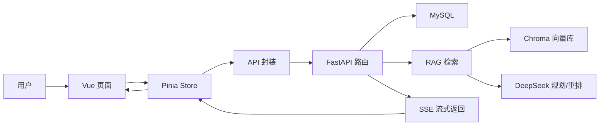
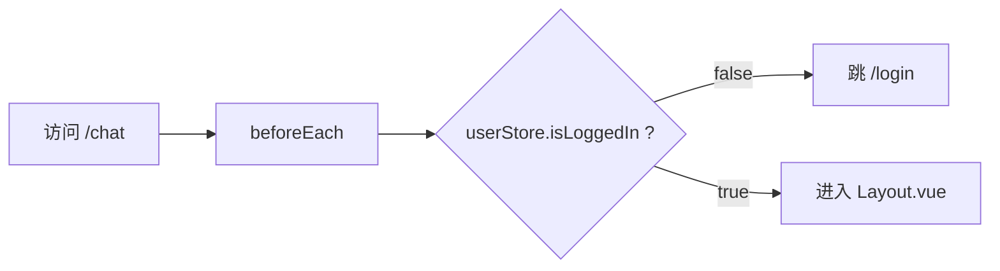
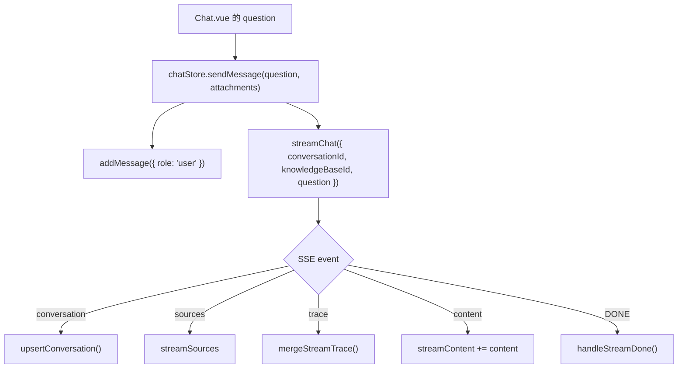
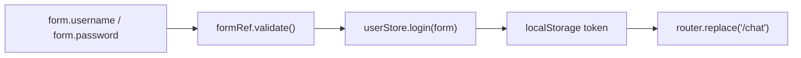
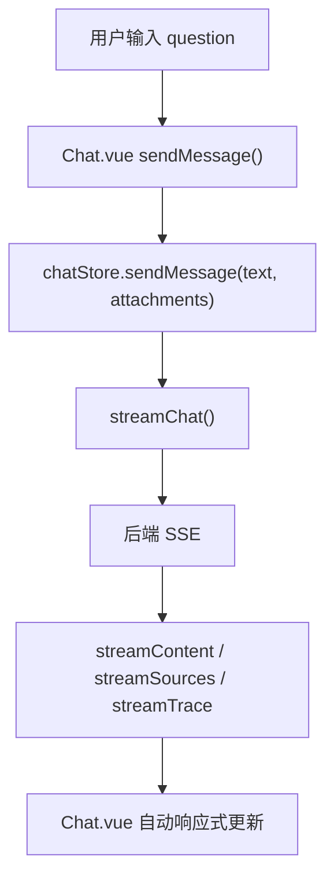
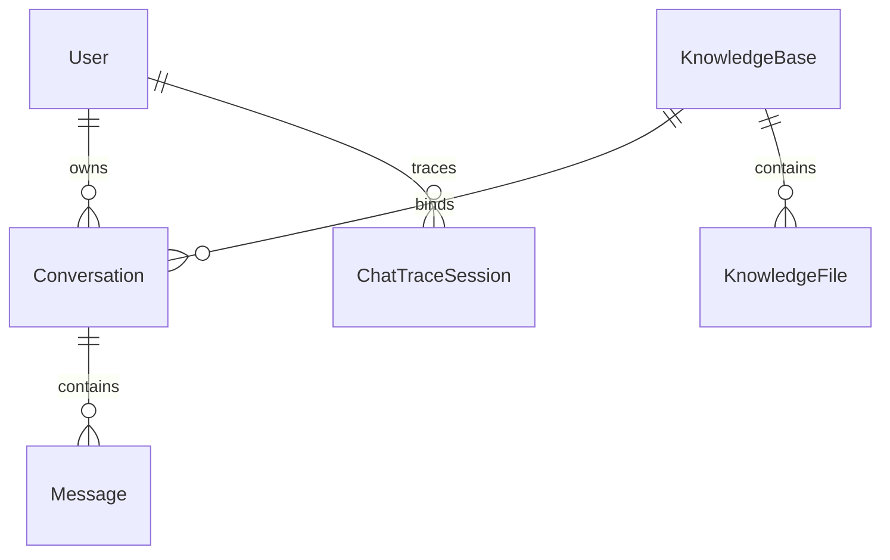
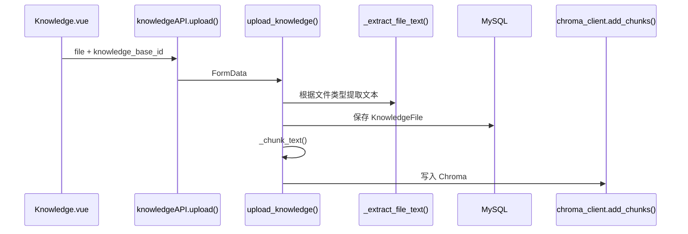
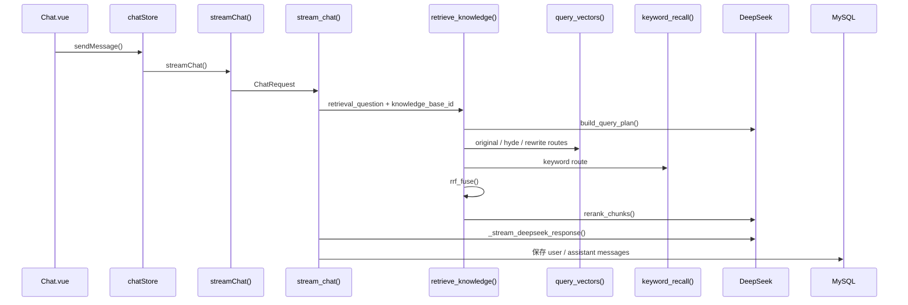
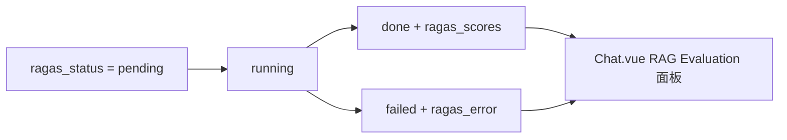
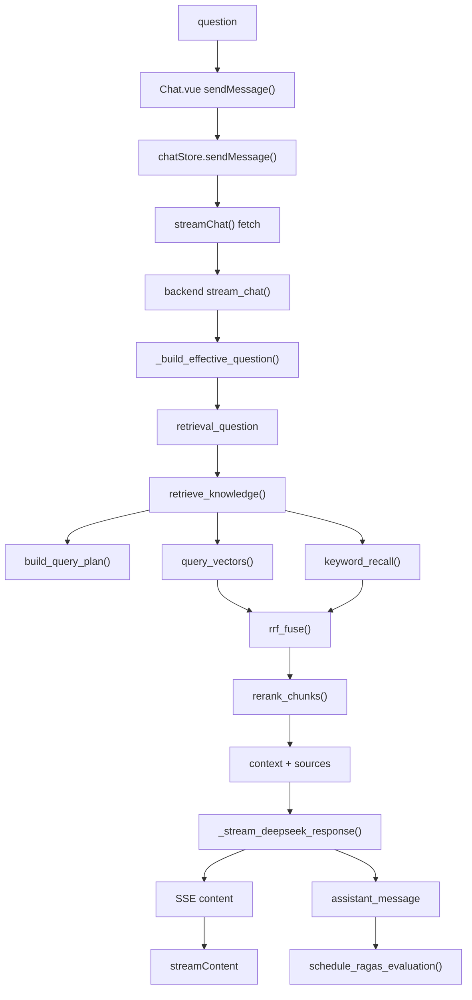

# 从 0 读懂这个项目所有代码

> 配套阅读：[PROJECT_ARCHITECTURE_FULL.md](./PROJECT_ARCHITECTURE_FULL.md)  
> 这份文档不是“源码目录说明”，而是一条学习路线：按一次真实请求的数据流，把前端、后端、数据库、RAG、Trace、RAGAS 串起来读。

## 0. 先建立正确读法

这个项目不要从 `src/` 第一行一路读到 `backend/` 最后一行。那样会很快迷路。

更好的读法是：

1. 先知道“用户做了什么”。
2. 再看“前端哪个变量接住了它”。
3. 再看“哪个 Store 方法把它变成请求”。
4. 再看“哪个 API 发到后端”。
5. 再看“后端哪个路由接住请求”。
6. 再看“后端怎么查数据库、查向量库、调模型”。
7. 最后看“结果怎么流式回前端、怎么落库、怎么被评估和回放”。

你读代码时只问三个问题：

| 问题 | 含义 |
|---|---|
| 这个变量从哪来？ | 来源：用户输入、接口响应、数据库、模型返回、计算结果 |
| 这个变量去哪了？ | 去向：页面展示、Store、API body、数据库字段、模型 prompt |
| 这个方法为什么存在？ | 职责：页面事件、状态同步、请求封装、业务编排、异常兜底 |

## 1. 全局地图：先看 20 分钟

先打开 `docs/PROJECT_ARCHITECTURE_FULL.md`，只看这些章节：

1. `总览架构图`
2. `前端架构图`
3. `后端架构图`
4. `数据库 ER 图`
5. `聊天 SSE、检索、RAGAS 与 Trace`

第一遍不要纠结每个函数内部，只要记住：



你只需要先形成一句话理解：

> 这是一个 Vue 前端工作台，调用 FastAPI 后端；后端把企业文件存到 MySQL 和 Chroma，聊天时检索知识库，再用 DeepSeek 流式生成答案，并把 Trace 和 RAGAS 评估结果保存下来。

## 2. 第一轮：读前端启动链

目标：知道页面是怎么被挂载、路由是怎么跳转、为什么没登录会回到登录页。

阅读顺序：

1. `src/main.js`
2. `src/App.vue`
3. `src/router/index.js`
4. `src/views/Layout.vue`

### 2.1 `src/main.js`

重点看：

| 符号 | 你要理解什么 |
|---|---|
| `createApp(App)` | 创建整个 Vue 应用 |
| `createPinia()` | 注册全局状态管理 |
| `router` | 注册路由 |
| `app.mount('#app')` | 把应用挂到 `index.html` 里的 DOM |

读完要能说：

> 浏览器打开页面后，Vue 从 `main.js` 启动，加载 `App.vue`，再交给 router 决定显示哪个页面。

### 2.2 `src/App.vue`

它只有：

```vue
<router-view />
```

意思是：真正显示哪个页面由路由决定。

### 2.3 `src/router/index.js`

重点看：

| 符号 | 作用 |
|---|---|
| `routes` | 定义 `/login`、`/chat`、`/knowledge`、`/learn`、`/profile` |
| `Layout.vue` | 登录后的外壳页面 |
| `router.beforeEach()` | 登录守卫 |
| `userStore.isLoggedIn` | 判断 token 是否存在 |

你要追一条线：



### 2.4 `src/views/Layout.vue`

它是登录后的“壳”：

| 区域 | 负责什么 |
|---|---|
| 左侧菜单 | 跳到智能问答、知识库管理、学习中心 |
| 历史会话 | 展示 `chatStore.conversations` |
| 用户入口 | 个人设置、退出登录 |
| `<router-view />` | 显示 Chat / Knowledge / Learn / Profile |

重点变量：

| 符号 | 来源 | 去向 |
|---|---|---|
| `chatStore` | `useChatStore()` | 历史会话列表、删除、新建 |
| `userStore` | `useUserStore()` | 用户头像、显示名、退出 |
| `activeMenu` | `route.path` 计算得出 | 左侧菜单高亮 |

读完第一轮，你要能回答：

1. 为什么 `/chat/:id` 和 `/chat` 都显示 `Chat.vue`？
2. 为什么未登录访问 `/knowledge` 会跳到 `/login`？
3. 为什么侧边栏能显示历史会话？

## 3. 第二轮：读前端状态层和请求层

目标：知道“页面变量”和“接口请求”之间怎么连接。

阅读顺序：

1. `src/api/request.js`
2. `src/api/auth.js`
3. `src/api/user.js`
4. `src/api/knowledge.js`
5. `src/api/chat.js`
6. `src/stores/user.js`
7. `src/stores/knowledge.js`
8. `src/stores/chat.js`

### 3.1 先读 `request.js`

这是普通 HTTP 请求的统一入口。

重点看：

| 符号 | 作用 |
|---|---|
| `axios.create()` | 创建请求实例 |
| `baseURL` | 默认 `/api` |
| 请求拦截器 | 从 `localStorage` 取 `token`，写入 `Authorization` |
| 响应拦截器 | 返回 `response.data`，统一处理 401 |

读懂这句就够：

> 普通接口不用每次手写 token，因为 `request.js` 会自动加。

### 3.2 再读 `api/*.js`

这些文件不做业务，只做“把函数名变成接口地址”。

| 文件 | 核心方法 | 后端路径 |
|---|---|---|
| `auth.js` | `authAPI.login()` | `POST /api/auth/login` |
| `user.js` | `userAPI.getProfile()` | `GET /api/user/profile` |
| `knowledge.js` | `knowledgeAPI.createBase()` | `POST /api/knowledge-bases` |
| `knowledge.js` | `knowledgeAPI.upload()` | `POST /api/knowledge/upload` |
| `chat.js` | `chatAPI.getConversations()` | `GET /api/chat/conversations` |
| `chat.js` | `streamChat()` | `POST /api/chat/stream` |

特别注意：`streamChat()` 没有用 axios，而是用 `fetch()`。

原因：

> 聊天回答是 SSE 流式返回，需要 `response.body.getReader()` 一段段读，所以用 fetch 更直接。

### 3.3 读 `userStore`

这是登录态中心。

| 符号 | 来源 | 去向 |
|---|---|---|
| `token` | `localStorage.getItem('token')` 或登录返回 | 路由守卫、请求头 |
| `username` | localStorage 或后端返回 | 页面显示 |
| `profile` | `userAPI.getProfile()` | 头像、创建时间 |
| `isLoggedIn` | `Boolean(token.value)` | `router.beforeEach()` |
| `login()` | 登录页调用 | 写 token、拉资料 |
| `logout()` | Layout 调用 | 清 token、清用户 |

### 3.4 读 `knowledgeStore`

这是知识库列表中心。

| 符号 | 作用 |
|---|---|
| `knowledgeBases` | 当前所有知识库 |
| `loaded` | 避免重复拉取 |
| `fetchKnowledgeBases()` | 首次或按需拉列表 |
| `refreshKnowledgeBases()` | 强制刷新 |
| `upsertKnowledgeBase()` | 创建或重命名后本地更新 |

### 3.5 读 `chatStore`

这是项目最重要的前端 Store。

先只抓主变量：

| 符号 | 作用 |
|---|---|
| `conversations` | 左侧历史会话 |
| `currentId` | 当前会话 ID |
| `messages` | 当前会话消息 |
| `selectedKnowledgeBaseId` | 当前问答绑定的知识库 |
| `streaming` | 是否正在生成 |
| `streamContent` | 正在拼接的回答 |
| `streamSources` | 参考资料 |
| `streamTrace` | 流式 Trace |
| `errorMessage` | 页面错误提示 |

再抓主方法：

| 方法 | 作用 |
|---|---|
| `fetchConversations()` | 拉历史会话 |
| `selectConversation()` | 选会话并拉消息 |
| `sendMessage()` | 发起聊天主入口 |
| `handleStreamDone()` | SSE 完成后刷新消息和 RAGAS |
| `handleStreamError()` | SSE 出错处理 |
| `mergeStreamTrace()` | 合并后端 trace 事件 |
| `refreshMessages()` | 从后端刷新消息 |
| `startEvaluationPolling()` | 轮询 RAGAS 状态 |

读懂 `chatStore.sendMessage()` 时，按这条线追：



第二轮读完，你要能回答：

1. token 是在哪里写入 localStorage 的？
2. 普通 API 请求为什么自动带 Authorization？
3. 聊天为什么不用 axios？
4. `streamContent` 是怎么一点点出现文字的？

## 4. 第三轮：按页面读前端

目标：知道每个页面的变量、方法、事件如何配合。

### 4.1 `Login.vue`

读法：

1. 看 template：表单有哪些输入框。
2. 看 script：这些输入框绑定了哪个变量。
3. 看 `handleLogin()`：点击登录后发生什么。

核心线：



### 4.2 `Knowledge.vue`

这是知识库管理页。先看四件事：

| 功能 | 入口方法 | 后端 |
|---|---|---|
| 拉知识库 | `initializeKnowledgeBases()` | `GET /api/knowledge-bases` |
| 新建知识库 | `submitKnowledgeBaseDialog()` | `POST /api/knowledge-bases` |
| 上传文件 | `handleUpload()` | `POST /api/knowledge/upload` |
| 删除文件 | `confirmDelete()` | `DELETE /api/knowledge/{fid}` |

重点变量：

| 符号 | 作用 |
|---|---|
| `currentKnowledgeBaseId` | 当前操作哪个知识库 |
| `allFiles` | 文件列表 |
| `keyword` | 搜索关键字 |
| `filteredFiles` | 搜索和排序后的文件 |
| `pagedFiles` | 当前页文件 |
| `knowledgeBaseForm.name` | 新建/重命名知识库名称 |

### 4.3 `Chat.vue`

这是最核心页面。读它不要从 template 第一行读到最后一行，按功能块读：

| 功能块 | 变量 | 方法 |
|---|---|---|
| 输入问题 | `question` | `sendMessage()` |
| 选择知识库 | `selectedKnowledgeBaseId` | `changeKnowledgeBase()` |
| 发送图片 | `attachments` | `handleImageUpload()` |
| 展示来源 | `activeSources` | `openSources()` |
| 展示 Trace | `activeTrace` | `openTrace()` |
| RAGAS 面板 | `ragasMetrics` | `formatScore()` / `ragasStatusText()` |
| 会话重命名 | `renaming` / `renameTitle` | `startRename()` / `confirmRename()` |

Chat 的主线：



### 4.4 `Learn.vue`

这是学习中心，用来帮助你看懂主流程。

重点变量：

| 符号 | 作用 |
|---|---|
| `mode` | 示例演示 / 真实回放 |
| `demoPath` | 示例链路节点顺序 |
| `flowSpec` | 画布节点和连线 |
| `traceIdInput` | 用户输入的 trace_id |
| `normalizedTrace` | 后端返回的真实 trace |

如果你刚开始读代码，`Learn.vue` 可以当“可视化目录”用，不要先钻它的 UI 细节。

## 5. 第四轮：读后端入口、模型、数据库

目标：知道后端如何接请求、如何鉴权、如何落库。

阅读顺序：

1. `backend/config.py`
2. `backend/models.py`
3. `backend/database.py`
4. `backend/main.py` 的前 500 行

### 5.1 `config.py`

它不做业务，只集中读取环境变量。

重点分组：

| 分组 | 作用 |
|---|---|
| MySQL | 主数据库 |
| Chroma | 向量库 |
| DeepSeek | 聊天、规划、重排 |
| DashScope embedding | 文本向量化 |
| RAGAS | 回答质量评估 |
| OSS | 图片和头像 |
| JWT | 登录鉴权 |

### 5.2 `models.py`

先把表关系记住：



每个模型一句话：

| 模型 | 一句话 |
|---|---|
| `User` | 谁在用系统 |
| `KnowledgeBase` | 一个独立知识库 |
| `KnowledgeFile` | 上传到知识库里的文件和全文 |
| `Conversation` | 一段聊天历史，绑定一个知识库 |
| `Message` | 用户消息和 assistant 回答 |
| `ChatTraceSession` | 一次问答流程的调试回放 |

### 5.3 `database.py`

重点看：

| 方法 | 作用 |
|---|---|
| `get_db()` | 给 FastAPI 路由提供数据库会话 |
| `init_db()` | 启动时建表和修复 schema |
| `_ensure_schema_columns()` | 补字段 |
| `_ensure_mysql_utf8mb4()` | 修复中文字符集 |
| `_ensure_default_knowledge_base()` | 保证至少有一个知识库 |

### 5.4 `main.py` 前半部分

先不要读完 2000 行，按路由读。

| 区域 | 你要看什么 |
|---|---|
| `lifespan()` | 启动时做什么 |
| `create_token()` / `get_current_user()` | 登录鉴权 |
| `login()` / `logout()` | 登录退出 |
| `list_conversations()` / `get_messages()` | 会话读取 |
| `create_knowledge_base()` | 知识库创建 |
| `upload_chat_attachment()` | 聊天图片上传 |
| `stream_chat()` | 聊天主入口 |

## 6. 第五轮：读知识库上传链路

目标：知道文件如何从 PDF/DOCX 变成可检索 chunk。

主线：



按这个顺序读：

1. `Knowledge.vue` 的 `handleUpload()`
2. `knowledgeAPI.upload()`
3. `backend/main.py` 的 `upload_knowledge()`
4. `_extract_file_text()`
5. `_extract_docx_text()` / `_extract_pdf_text()`
6. `_chunk_text()`
7. `chroma_client.add_chunks()`

关键变量追踪：

| 变量 | 来源 | 去向 |
|---|---|---|
| `file` | 用户选择的文件 | `FormData` |
| `knowledge_base_id` | 当前知识库 ID | 后端绑定文件 |
| `text` / `content` | 文件提取结果 | `KnowledgeFile.content` |
| `chunks` | `_chunk_text()` | `add_chunks()` |
| `file_id` | MySQL 插入后生成 | Chroma metadata |

读完要能回答：

1. 为什么先保存 MySQL，再写 Chroma？
2. 如果数据库保存失败，为什么不应该继续写 Chroma？
3. `knowledge_base_id` 如何保证多知识库隔离？

## 7. 第六轮：读聊天与 RAG 主链路

目标：完整追踪一次提问如何得到回答。

推荐问题：

```text
员工迟到、早退在 30 分钟以内，公司会如何处罚？
```

主线：



按这个顺序读：

1. `Chat.vue` 的 `sendMessage()`
2. `chatStore.sendMessage()`
3. `streamChat()`
4. `backend/main.py` 的 `stream_chat()`
5. `_build_effective_question()`
6. `_build_memory_context()`
7. `retrieve_knowledge()`
8. `build_query_plan()`
9. `query_vectors()`
10. `keyword_recall()`
11. `rrf_fuse()`
12. `rerank_chunks()`
13. `_build_sources()`
14. `_stream_deepseek_response()`
15. assistant message 保存逻辑
16. `schedule_ragas_evaluation()`

最重要的变量：

| 变量 | 来源 | 作用 |
|---|---|---|
| `question` | 前端输入框 | 用户原始问题 |
| `selectedKnowledgeBaseId` | 前端知识库选择 | 请求体里的 `knowledge_base_id` |
| `ChatRequest.conversation_id` | 前端当前会话 | 判断新会话还是旧会话 |
| `effective_question` | `_build_effective_question()` | 图片 + 文本后的问题 |
| `retrieval_question` | 记忆增强后 | 真正用于检索 |
| `query_plan` | `build_query_plan()` | HyDE、改写、关键词 |
| `keyword_chunks` | `keyword_recall()` | 关键词召回结果 |
| `fused` | `rrf_fuse()` | 多路融合候选 |
| `reranked` | `rerank_chunks()` | 重排结果 |
| `context` | `knowledge_chunks` 拼接 | 大模型 prompt 上下文 |
| `sources` | `_build_sources()` | 前端参考资料 |
| `full` | SSE chunk 拼接 | assistant 完整回答 |
| `assistant_message` | Message ORM | 最终保存的回答 |

## 8. 第七轮：读 Trace 和 RAGAS

目标：知道为什么学习中心能回放流程，为什么回答后还能显示评估分数。

### 8.1 Trace

读：

1. `backend/learning_trace.py`
2. `backend/main.py` 里的 `_safe_trace_add()`
3. `stream_chat()` 中所有 `trace.add(...)`
4. `src/views/Learn.vue`
5. `src/views/LearnTracePanel.vue`

Trace 事件结构：

| 字段 | 含义 |
|---|---|
| `index` | 第几步 |
| `stage` | 阶段名 |
| `function` | 真实函数名 |
| `params` | 输入参数 |
| `uses` | 使用了什么变量 |
| `creates` | 创建了什么变量 |
| `result` | 结果 |
| `note` | 零基础解释 |

### 8.2 RAGAS

读：

1. `schedule_ragas_evaluation()`
2. `evaluate_message_async()`
3. `_evaluate_message_sync()`
4. `_mark_message()`
5. `chatStore.startEvaluationPolling()`

状态流：



## 9. 10 个必须掌握的变量

| 变量 | 所在文件 | 来源 | 去向 |
|---|---|---|---|
| `token` | `src/stores/user.js` | 登录响应 | localStorage、请求头、路由守卫 |
| `currentId` | `src/stores/chat.js` | 当前会话或后端 conversation event | 路由、消息刷新、streamChat |
| `messages` | `src/stores/chat.js` | `getMessages()` 或本地追加 | Chat 页面渲染 |
| `selectedKnowledgeBaseId` | `src/stores/chat.js` / `Chat.vue` | 用户选择或会话绑定 | `knowledge_base_id` |
| `streamContent` | `src/stores/chat.js` | SSE content chunk | Chat 页面正在生成回答 |
| `streamSources` | `src/stores/chat.js` | SSE sources event | 参考资料按钮 |
| `streamTrace` | `src/stores/chat.js` | SSE trace event | 流程按钮 / 学习中心 |
| `retrieval_trace` | `backend/main.py` / `messages` | `retrieve_knowledge()` 返回 | Message 表、Trace 回放 |
| `ragas_status` | `messages` | assistant 保存时 pending，RAGAS 后更新 | RAG Evaluation 面板 |
| `knowledge_base_id` | 前后端请求体/数据库 | 知识库选择 | 多知识库隔离 |

## 10. 每轮读完的验收题

### 前端入口

- `main.js` 为什么要 `app.use(createPinia())`？
- `App.vue` 为什么只有一个 `router-view`？
- `/chat/:id` 为什么还是显示 `Chat.vue`？

### 前端状态

- `userStore.isLoggedIn` 的值来自哪里？
- `request.js` 如何让每个请求自动带 token？
- `chatStore.sendMessage()` 为什么先本地加一条 user message？

### 知识库

- 新建知识库成功后，前端为什么要 `upsertKnowledgeBase()`？
- 上传文件时，`knowledge_base_id` 从哪里来？
- 文件内容为什么既存在 MySQL 又写入 Chroma？

### 聊天

- `streamChat()` 为什么要解析 `data: [DONE]`？
- `sources` 和普通回答文本为什么走不同 SSE event？
- `TraceRecorder.add()` 记录的变量如何进入前端？

### 后端 RAG

- `build_query_plan()` 失败时为什么还可以检索？
- `keyword_recall()` 和 `query_vectors()` 谁更适合精确制度问答？
- `rrf_fuse()` 解决了什么问题？
- `rerank_chunks()` 失败后为什么不能直接中断回答？

### RAGAS

- 为什么 RAGAS 不在回答前执行？
- `ragas_status` 为什么会有 `pending / running / done / failed`？
- 前端为什么要轮询评估状态？

## 11. 建议学习节奏

| 阶段 | 时间 | 目标 |
|---|---:|---|
| 第 1 天 | 1-2 小时 | 看懂总览图、路由、Layout、登录 |
| 第 2 天 | 2 小时 | 看懂 API 封装和三个 Store |
| 第 3 天 | 2-3 小时 | 看懂 Chat 主页面和 SSE 前端处理 |
| 第 4 天 | 2 小时 | 看懂 models、database、知识库上传 |
| 第 5 天 | 3 小时 | 看懂 `stream_chat()` 主链路 |
| 第 6 天 | 2-3 小时 | 看懂 retrieval、Chroma、关键词增强 |
| 第 7 天 | 2 小时 | 看懂 Trace、RAGAS、学习中心 |

## 12. 读源码时的标记方法

每看到一个变量，在纸上或文档里写三列：

```text
变量名：
从哪来：
去哪了：
为什么存在：
```

例子：

```text
变量名：selectedKnowledgeBaseId
从哪来：Chat.vue 的 el-select，或 chatStore 当前会话绑定的 knowledge_base_id
去哪了：streamChat() 请求体里的 knowledge_base_id
为什么存在：保证本次问答只检索当前知识库，避免串库
```

每看到一个方法，写三列：

```text
方法名：
谁调用它：
它调用谁：
它改变了哪些变量：
```

例子：

```text
方法名：chatStore.sendMessage()
谁调用它：Chat.vue 的 sendMessage()
它调用谁：streamChat()
它改变了哪些变量：streaming、streamContent、streamSources、streamTrace、messages
```

## 13. 最后一关：手动画出一次问答

当你觉得自己读懂了，用下面这句话做测试：

```text
员工迟到、早退在 30 分钟以内，公司会如何处罚？
```

你要能画出：



如果这张图你能自己解释清楚，这个项目的主干你就真正掌握了。

