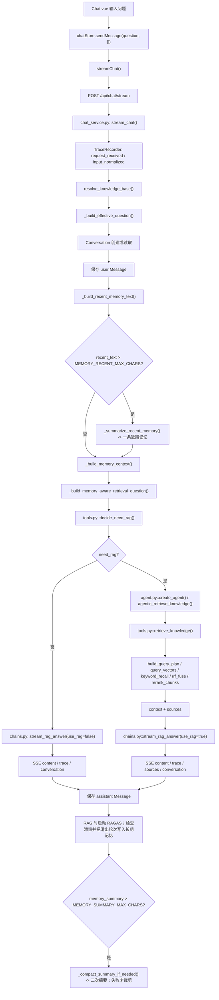
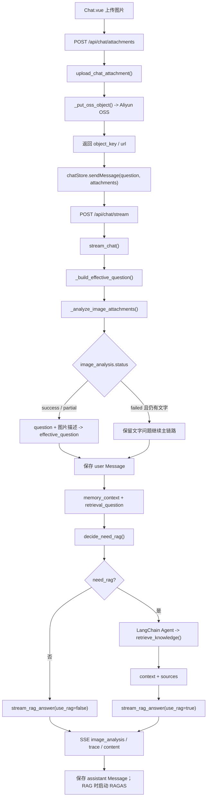
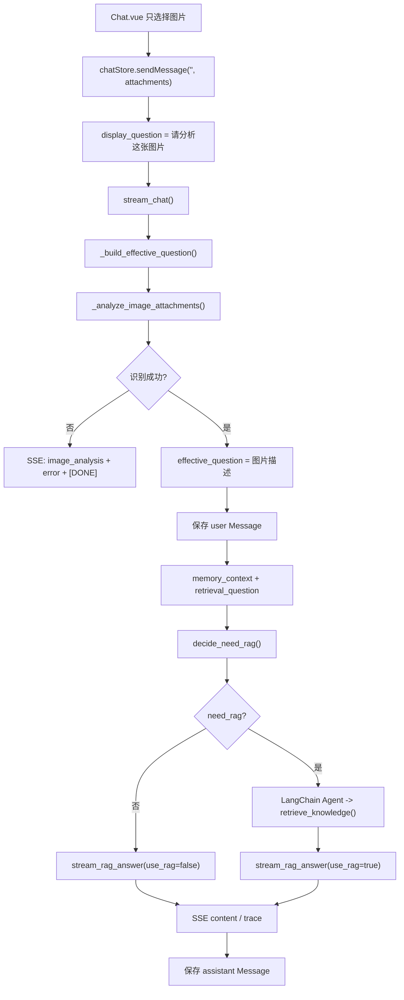
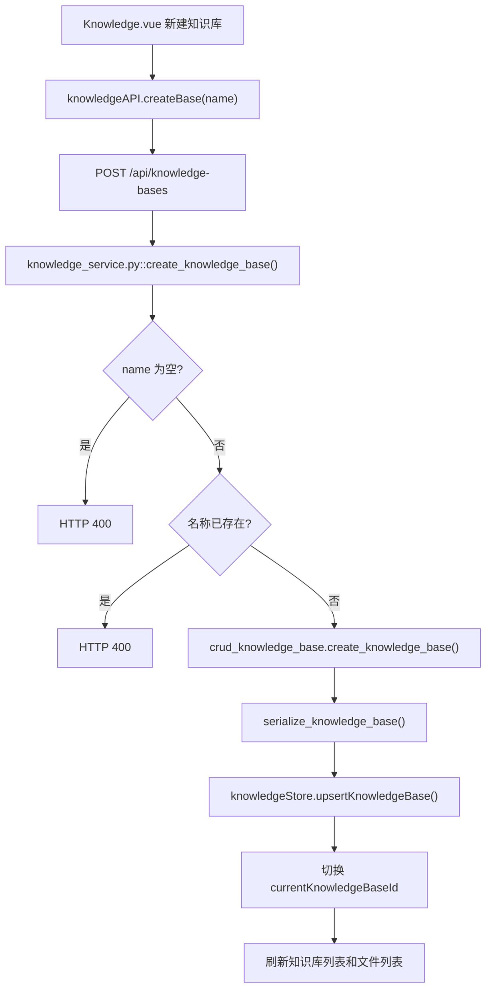
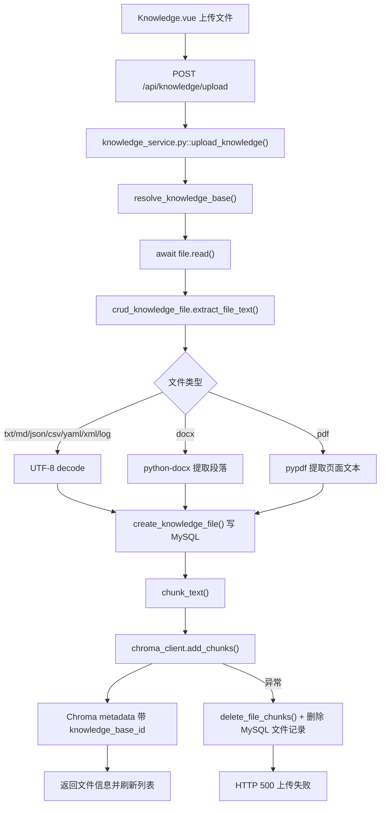

# PROJECT_FLOW_DIAGRAM

这份文档只画当前真实链路。聊天 RAG 编排已经迁移到 LangChain 运行时，不再保留旧 `agentic_rag.py`、`tool.py`、`retrieval.py`、`rag_gate.py` 空壳。

主要模块：

- 前端聊天：`src/views/Chat.vue`、`src/stores/chat.js`、`src/api/chat.js`
- 后端聊天：`backend/service/chat_service.py`
- LangChain RAG：`backend/agent/agent.py`、`tools.py`、`chains.py`、`llm.py`
- 记忆与图片：`backend/rag/memory_service.py`、`vision_service.py`
- 知识库：`backend/service/knowledge_service.py`、`backend/crud/knowledge_file.py`、`backend/rag/chroma_client.py`

## 1. 纯文字问答

共用主链路仍是 `Chat.vue -> chatStore.sendMessage() -> streamChat() -> /api/chat/stream -> stream_chat()`。区别只在后端内部：路由、工具、Agent 和最终生成已经由 `agent/tool/rag` 承接。

## 2. 文字 + 图片问答

图片只是前置分支。识别成功后，它会合并成文本问题进入同一条 LangChain 聊天主链路。

## 3. 纯图片问答

纯图片场景只有在图片识别失败且没有文字问题时提前结束；否则会复用完整聊天闭环。

## 4. 创建知识库

前端负责刷新和切换视图，后端负责重名校验和默认知识库回退。

## 5. 上传文件入库

入库仍是 MySQL 元数据先落库，再写 Chroma；向量写入失败会回滚文件记录和已写入 chunk。
